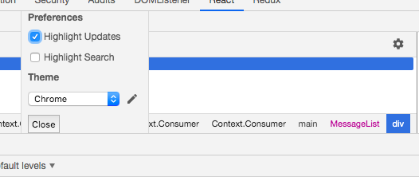

This project was bootstrapped with [Create React App](https://github.com/facebook/create-react-app).

# React Context App

## Basic Use

1. Create a file with the contex define, the context object contains two properties: Consumer and Provider.

```
const Context = React.createContext();
// Context.Consumer, Context.Provider

export default Context;
```

2. Wrap the parent component with the provider.


```
import UserContext from .../
....

state = {
  currentUser: 'Rolando'
}

<UserContext.Provider value={{ user: this.state.currentUser}}>
	<div></div>
</UserContext.Provider>
```

3. Wrap the children component with the consumer, the consumer expect you to pass a single function as a child.

```
import UserContext from .../;

<UserContext.Consumer>
	{({user}) => 
		<div>
			<p>{user.firstName}</p>
		</div>
	}
</UserContext.Consumer>
```

## Clever use

1. Inside the context file, declare a component.

```
import React from 'react';

const { Provider, Consumer } = React.createContext();

class UserProvider extends React.Component {
  state = {
    currentUser: 'Rolando'
  };

  // functions, declare here

  render() {
    return (
      <Provider
        value={{
          user: this.state.currentUser,
          onLogin: this.handleLogin,
          onLogout: this.handleLogout
        }}
      >
        {this.props.children}
      </Provider>
    );
  }

export { UserProvider, Consumer as UserConsumer };

```

2. Inside a parent component, import the provider and consumer and wrap the componet with them.

```
	<UserProvider>
		<UserConsumer>
			{({ user }) =>
				<div>
					<p>{user.firstName}</p>
				</div>
			}
		</UserConsumer>
	</UserProvider>
```

3. Inside a children component, import the consumer and wrap the componet with it.

```
<UserConsumer>
	{({ onLogin }) =>
		<div>
			<button 
				onClick={() => (onLogin({ username: 'James' }))}>
				Click
			</button>
		</div>
	}
</UserConsumer>
```
## Multiple context

Context can be nested like components, like:

```
 	<Provider1>
		<Provider2>
	.....
```

Then as childrens

```
 <Consumer1>
	<Consumer2>
	.....
```
## Matching providers

https://codesandbox.io/s/contextsandboxapp-1qpq6

## React 16

Context can be use without the consumer and the inside function when using hooks.

1. Declare a static property inside the class component that takes the consumer

* This static property is only available in classes.

```
import { UserConsumer } from './UserContext';

class UserMenu extends React.Component {
	static = contextType = UserContext;

```

2. Inside the context component, redeclare the component like:

```
let UserContext;
// Consumer and Provider comes with Context
const { Provider, Consumer } = UserContext = React.createContext();

.....

export { UserProvider, Consumer as UserConsumer, UserContext }

```

3. Back in the component we are using the consumer, we destructure the context and remove the provider and function:

```
import { UserContext } from './UserContext';

// The consumer and funcion are gone

 render() {
    const { user, onLogout } = this.context;
    return (
      <div className="UserMenu">
			......

```
> Note: This approach only works for one context ( no nested ones ).

### With hooks

1. Import useContext ```import React, { useContext } from 'react';```

2. Declare a variable passing the context inside the component

```
const MessageList = () => {
  const { user, age } = useContext(UserContext);
	return (
    <div className="MessageList">
      <p>{user} {age}</p>
			......
```

3. Use the component without the consumer.

### Performace check

#### Rerenders
- Open up the react dev tools
- Press on the wheal
- Click on higlight updates



#### Profiler
- Click on Profile
- Press the circle
- Press stop
- See things in action